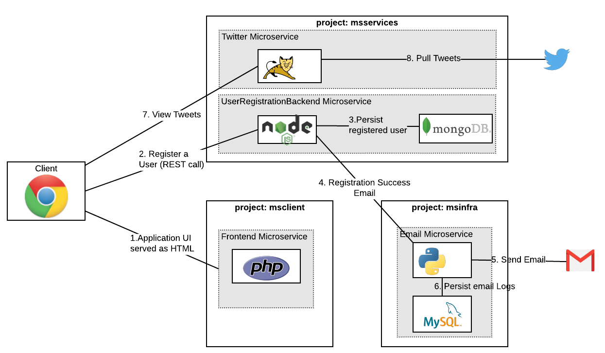

# Network Policy Objects in Action

This article demonstrates using Network Policy Objects to restrict traffic flow between application components or microservices. Network Policy Objects allow you to define policy based on which the traffic is allowed to specific services and prevent to the rest.  

As of writing of this article, this feature is in "Technology Preview" in OpenShift 3.6.

**Prerequisites**	

* To test this concept, you have to install an OpenShift Cluster with `redhat/openshift-ovs-networkpolicy` using `os_sdn_network_plugin_name` in the ansible hosts file or enable network policy in an existing cluster as explained here [https://docs.openshift.com/container-platform/3.6/admin_guide/managing_networking.html#admin-guide-networking-networkpolicy](https://docs.openshift.com/container-platform/3.6/admin_guide/managing_networking.html#admin-guide-networking-networkpolicy)

###Understanding Sample Application	

To look at a practical example that show cases Network Policy Objects, we'll use a sample application that is made up of a bunch of microservices from this git repository [https://github.com/VeerMuchandi/microservices-on-openshift](https://github.com/VeerMuchandi/microservices-on-openshift). 

Deploying these microservices will provide you a case to understand ***how Network Policy Objects are useful***. 

This application has 4 microservices written using different technologies just to show case how polyglot microservices talk to each other. Some of these microservices have application logic and a database. All the components run as containers on OpenShift.	

1. [Front End Service](https://github.com/VeerMuchandi/microservices-on-openshift/tree/master/php-ui) that provides UI to registers users, allows you to login, and displays the tweets for all the registered users, written in PHP.

2. 	[Email service](https://github.com/VeerMuchandi/microservices-on-openshift/tree/master/python-email-api) that can send emails to a registered user, written in Python that saves data in MySQLDB		

3. [Twitter service](https://github.com/VeerMuchandi/microservices-on-openshift/tree/master/java-twitter-feed-api) that pulls tweets for a registered user, written in Java running on Tomcat. This service is called by the Front End HTML directly.	
4. [User Registration Backend](https://github.com/VeerMuchandi/microservices-on-openshift/tree/master/nodejs-users-api) that registers the users, saves the registered user in a MongoDB and written in Node.Js. This service is called by the Front End HTML and does the job of user registration. One the user is registered it calls the Email Service to send an email confirmation.

This is all explained in this [application's git repository](https://github.com/VeerMuchandi/microservices-on-openshift). For our network policy use case, we will deploy these microservices into three different projects

1. `msclient` project hosts the front-end service
2. `msservices` project hosts the user-registration backend service and the twitter service
3. `msinfra` project hosts the email service

The deployment model for these microservices and the expected interations (in order) are shown in the figure below. Please spend a minute to understand this.



###Deploy the application

**Prerequisites**	 

* For Email Service to work, you will need a gmail account to send emails. You would also have to turn on [access for less secure apps](https://myaccount.google.com/lesssecureapps) on this gmail account so that the application can login and send emails. **Caution** Don't use your personal gmail. Create a new one that you don't use, so that you don't care even if it is hacked.
* For Twitter Service to work, you will access keys and tokens to work with Twitter. Refer documentation here [https://dev.twitter.com/oauth/overview/application-owner-access-tokens](https://dev.twitter.com/oauth/overview/application-owner-access-tokens)

**Step 1** Clone the repository to your local machine 

```
git clone https://github.com/VeerMuchandi/microservices-on-openshift
```
and change to the `microservices-on-openshift/installscripts` folder

```
cd microservices-on-openshift/install-scripts
```

**Step 2** Create three projects
Assuming that you have already logged into the OpenShift Cluster

```
oc new-project msclient
oc new-project msservices
oc new-project msinfra
```

**Step 3** Setting environment variables

Edit [1.setVariable.sh](https://github.com/VeerMuchandi/microservices-on-openshift/blob/master/installscripts/1.setVariable.sh) script to set the following values:

* `OSE_DOMAIN` to your openshift domain name.

* `OSE_CLIENT_PROJECT` to `msclient`
 
* `OSE_SERVICES_PROJECT` to `msservices`
 
* `OSE_INFRA_PROJECT` to `msinfra`
 
* `FROM_GMAIL` to your gmail account from where you want to send gmails.
 
* `FROM_GMAIL_PASSWORD` password for the above gmail account
 
* And values for `TWITTER_CONSUMER_KEY`, `TWITTER_CONSUMER_SECRET`, `TWITTER_OAUTH_ACCESS_TOKEN`, `TWITTER_OAUTH_ACCESS_TOKEN_SECRET`

Run the script as follows

```
source 1.setVariable.sh
```

**Step 4** Deploy microservices by running the following scripts

This script will build and deploy Email Service and the MySQLDB in the `msinfra` project.

```
source 2.deployEmailSvc-PythonMySQL.sh
```

This script will build and deploy Twitter Service in the `msservices` project 

```
source 3.deployTwitter-Tomcat.sh
```

This script will build and deploy User Registration Backend Service in the `msservices` project

```
source 4.deployUserRegBackend-NodejsMongo.sh
```

This script will build and deploy Frontend Service in the `msclient` projecgt

```
source 5.deployFrontend-PHP.sh
```

In a few minutes you will notice all the services up and running. You should see as follows:

```
$ oc get pods -n msclient
NAME              READY     STATUS      RESTARTS   AGE
userreg-1-build   0/1       Completed   0          1m
userreg-1-tm3x8   1/1       Running     0          1m

$ oc get pods -n msservices
NAME                  READY     STATUS      RESTARTS   AGE
mongodb-1-2zx66       1/1       Running     0          2m
twitter-api-1-build   0/1       Completed   0          2m
twitter-api-1-srvvm   1/1       Running     0          1m
userregsvc-1-b4xq3    1/1       Running     0          1m
userregsvc-1-build    0/1       Completed   0          2m

$ oc get pods -n msinfra
NAME               READY     STATUS      RESTARTS   AGE
emailsvc-1-build   0/1       Completed   0          3m
emailsvc-1-grb00   1/1       Running     0          2m
mysql-2-ffj05      1/1       Running     0          3m

$ oc get route -n msclient
NAME      HOST/PORT                                   PATH      SERVICES   PORT       TERMINATION   WILDCARD
userreg   userreg-msclient.apps.devday.ocpcloud.com             userreg    8080-tcp                 None

```

**Step 5** Test your application

Access the UI for frontend and register a couple of users. In my case the URL is http://userreg-msclient.apps.devday.ocpcloud.com.  If email is configured correctly the user that is registered should receive an email. Also you should be able to pull the tweets for the configured user.

So far we just deployed a few microservices and used them on OpenShift.

**Now we will see why we need Network Policy Objects**

We have a hack in the Frontend Service code. If you access your <<front-endurl>>/hack.php, it talks to the MySQLDB in the `msinfra` project and pull all the data and show as below.

```
$ curl http://userreg-msclient.apps.devday.ocpcloud.com/hack.php
Here is the list of emails sent: <br>
From Address: xxx@gmail.comTo Address: yyy@gmail.comSubject: New registrationWhen: 2017-08-22<br>
From Address: xxx@gmail.comTo Address: zzz@gmail.comSubject: New registrationWhen: 2017-08-22<br>
End of the list <br>
```
--------------

**Issue:** Ideally UI should not reach a database behind a microservice and should go via the APIs exposed by the microservice. It is a well-known architecture practice that if you are running an application multi-tiered architecture, your UI layer should not be talking to the a database directly but go via APIs exposed by business logic. In fact, the database is generally firewalled and only ports from the services that are supposed to call the database are allowed. If you are using a flat network such as `ovs-subnet`, these fine grained network controls between services are not possible. 

This article explains what Network Policy Objects are and how they can be used to control network traffic in theory.
[https://blog.openshift.com/whats-new-in-openshift-3-5-network-policy-tech-preview/](https://blog.openshift.com/whats-new-in-openshift-3-5-network-policy-tech-preview/)

--------------

**Step 6** Network Policy Objects to rescue

Let us now add Network Policy controls to our microservices so that above kind of hack is not allowed.

* Now let us add policies that allow specific traffic to your services

Let's protect the MySQLDB behind the Email Service to be only accessible from the Email Service. Create a file with the following content.

```
$ cat allow-3306.yaml 
kind: NetworkPolicy
apiVersion: extensions/v1beta1
metadata:
  name: allow-3306
spec:
 podSelector:
   matchLabels:
     app: mysql
 ingress:
 - from: 
   - podSelector:
       matchLabels:
         app: emailsvc        
   ports:
   - protocol: TCP
     port: 3306
```

Here we are allowing traffic coming from pods that have labels matching `app: emailsvc` to reach the MySQL pod that has label `app:mysql`. Look at the labels assigned to pods and services to understand how this works.

```
$ oc get svc -n msinfra --show-labels
NAME       CLUSTER-IP      EXTERNAL-IP   PORT(S)    AGE       LABELS
emailsvc   172.30.42.184   <none>        8080/TCP   1h        app=emailsvc,microservice=emailsvc
mysql      172.30.43.224   <none>        3306/TCP   1h        app=mysql,microservice=emailsvc

$ oc get pods -n msinfra --show-labels | grep Running
emailsvc-1-grb00   1/1       Running     0          1h        app=emailsvc,deployment=emailsvc-1,deploymentconfig=emailsvc,microservice=emailsvc
mysql-2-ffj05      1/1       Running     0          1h        app=mysql,deployment=mysql-2,deploymentconfig=mysql,microservice=emailsvc

```

Now create this policy in the `msinfra` project as follows

```
$ oc create -f allow-3306.yaml -n msinfra
networkpolicy "allow-3306" created
```
As soon as the policy is added, if you test the hack again, it should fail with `504 Gateway Time-out` as shown below

```

$ curl http://userreg-msclient.apps.devday.ocpcloud.com/hack.php
<html><body><h1>504 Gateway Time-out</h1>
The server didn't respond in time.
</body></html>

```

**Step 7** Fully protect your microservices

Let's add more policies now.

* Completely deny all traffic to `msclient` project

```
$ cat default-deny.yaml 
kind: NetworkPolicy
apiVersion: extensions/v1beta1
metadata:
  name: default-deny
spec:
  podSelector:
```

Create this policy

```
$ oc create -f default-deny.yaml -n msclient
networkpolicy "default-deny" created
```
Now if you test your UI, it should say `Application is not available`

You can see that the route (from loadbalancer) is reaching the service at port 8080.

```
$ oc get route -n msclient --show-labels
NAME      HOST/PORT                                   PATH      SERVICES   PORT       TERMINATION   WILDCARD   LABELS
userreg   userreg-msclient.apps.devday.ocpcloud.com             userreg    8080-tcp                 None       app=userreg,microservice=userreg
```

* So let's allow port 8080 for the the `userreg` service to enable communication with UI as below:

```
$ cat allow-8080-frontend.yaml 
kind: NetworkPolicy
apiVersion: extensions/v1beta1
metadata:
  name: allow-8080-frontend 
spec:
  podSelector:
    matchLabels:
      app: userreg
  ingress:
  - ports:
    - protocol: TCP
      port: 8080
      
$ oc create -f allow-8080-frontend.yaml -n msclient
networkpolicy "allow-8080-frontend" created
```
Now your frontend URL should work again!!

* Default Deny all traffic to `msservices` project

```
$ oc create -f default-deny.yaml -n msservices
networkpolicy "default-deny" created
```
* Allow 8080 to User Registration Backend and Twitter Services

```

$ cat allow-8080-userregsvc.yaml 
kind: NetworkPolicy
apiVersion: extensions/v1beta1
metadata:
  name: allow-8080-userregsvc
spec:
  podSelector:
    matchLabels:
      app: userregsvc
  ingress:
  - ports:
    - protocol: TCP
      port: 8080

$ cat allow-8080-twitter.yaml 
kind: NetworkPolicy
apiVersion: extensions/v1beta1
metadata:
  name: allow-8080-twitter  
spec:
  podSelector:
    matchLabels:
      app: twitter-api 
  ingress:
  - ports:
    - protocol: TCP
      port: 8080
      
      
$ oc create -f allow-8080-userregsvc.yaml -n msservices
networkpolicy "allow-8080-userregsvc" created
$ oc create -f allow-8080-twitter.yaml -n msservices
networkpolicy "allow-8080-twitter" created
```

* Allow MongoDB to be accessed only by User Registration Service

```
$ cat allow-27017.yaml 
kind: NetworkPolicy
apiVersion: extensions/v1beta1
metadata:
  name: allow-27107
spec:
 podSelector:
   matchLabels:
     app: mongodb
 ingress:
 - from: 
   - podSelector:
       matchLabels:
         app: userregsvc      
   ports:
   - protocol: TCP
     port: 27017
     
$ oc create -f allow-27017.yaml -n msservices
networkpolicy "allow-27107" created

```

* Deny all traffic to `msinfra` project

```
$ oc create -f default-deny.yaml -n msinfra
networkpolicy "default-deny" created
```

* We already have only Email Service accessing the MySQL DB. We will now have to allow connection to the Email Service in `msinfra` project from User Registration Service in a `msservices` project. While you can select the destination in this case, you cannot select a specific pod on the source side when the namespaces are different. So we will have to open up the namespace `msservices` to be able to reach Email Service in `msinfra`

First we will need a label to identify the (traffic) source project `msservices`. Your cluster-admin may have to do this.

```
# oc label namespace msinfra project=userregservices
namespace "msinfra" labeled

```

Now let's add the policy that allows services in `msservices` project to talk to Email Service in `msinfra` project. Note the `namespaceSelector` here, as we are opening traffic flow from `msservices` namespace here.

```
$ cat allow-8080-emailsvc.yml 
kind: NetworkPolicy
apiVersion: extensions/v1beta1
metadata:
  name: allow-8080-frontend 
spec:
  podSelector:
    matchLabels:
      app: userreg
  ingress:
  - from: 
    - namespaceSelector:
        matchLabels:
          project: userregservices
    ports:
    - protocol: TCP
      port: 8080
      
$ oc create -f allow-8080-emailsvc.yml -n msinfra
networkpolicy "allow-8080-frontend" created

```

Now we are all set. We have policies in place that prevent services crossing boundaries!!


###Summary

In this article we have learnt with examples:

* Why Network Policy Objects are important?
* Creating policies that deny all the traffic
* Opening up traffic to specific destinations based on labels
* Opening up traffic that crosses across projects


